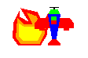
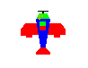
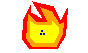

# SILI Game: Milestone 02
In this second milestone, you will create four classes to represent the game elements in your SILI game. They will provide a `Draw` function that draws the element to a given `graphics::Image` reference. The `Player` and `PlayerProjectile` classes will provide an `IntersectsWith` function to check whether it intersects or collides with another game element. 

## Opponent (opponent.h/opponent.cc)
Create an `Opponent` class that contains data members to represent its location on the screen: `x_` and `y_`. Create two constant data members to represent the size of the image: `kWidth_` and `kHeight_`. The suggested size is 50 x 50.

Create accessors and mutators for `x_` and `y_`, but only accessors for `kWidth_` and `kHeight_` because they are constants. Name your accessors `GetWidth` and `GetHeight` to make them easy to identify.

### Draw
Create a `Draw` member function that accepts a reference to a `graphics::Image` object. We use a reference so any changes we make to the object is reflected to the original image. You can reuse your `Draw` methods from milestone 1 to draw your opponent. However, take note that an opponent is located at a specific location on the screen. Make sure that your `Draw` function draws your opponent on the correct location of the `graphics::Image` parameter.

## OpponentProjectile (opponent.h/opponent.cc)
Create an `OpponentProjectile` class that contains data members to represent its location on the screen: `x_` and `y_`. Create two constant data members to represent the size of the image: `kWidth_` and `kHeight_`. The suggested size is 5 x 5.

Create accessors and mutators for `x_` and `y_`, but only accessors for `kWidth_` and `kHeight_` because they are constants. Name your accessors `GetWidth` and `GetHeight` to make them easy to identify.

### Draw
Create a `Draw` member function that accepts a reference to a `graphics::Image` object. We use a reference so any changes we make to the object is reflected to the original image. You can reuse your `Draw` methods from milestone 1 to draw your projectile. However, take note that a projectile is located at a specific location on the screen. Make sure that your `Draw` function draws your projectile on the correct location of the `graphics::Image` parameter.

## Player (player.h/player.cc)
Create a `Player` class that contains data members to represent its location on the screen: `x_` and `y_`. Create two constant data members to represent the size of the image: `kWidth_` and `kHeight_`. The suggested size is 50 x 50.

Create accessors and mutators for `x_` and `y_`, but only accessors for `kWidth_` and `kHeight_` because they are constants. Name your accessors `GetWidth` and `GetHeight` to make them easy to identify.

### Draw
Create a `Draw` member function that accepts a reference to a `graphics::Image` object. We use a reference so any changes we make to the object is reflected to the original image. You can reuse your `Draw` methods from milestone 1 to draw your player. However, take note that a player is located at a specific location on the screen. Make sure that your `Draw` function draws your player on the correct location of the `graphics::Image` parameter.

### IntersectsWith(Opponent)
Create an `IntersectsWith` parameter that accepts a constant reference to an `Opponent` object and returns a boolean value. We use a constant reference because this function should not modify the `Opponent` parameter. It will get information about the location and size of the `Opponent` parameter and check if it intersects with the `Player`. The image below shows one example of when intersection might happen. It is your job to identify other ways they might intersect and ensure that your function returns the correct result. The function should return `true` if the `Player` intersects with the `Opponent` parameter and `false` otherwise.



### IntersectsWith(OpponentProjectile)
This member function works exactly the same way as the `InterSectsWith` member function receiving an `Opponent` parameter. The difference is that this function receives an `OpponentProjectile` parameter instead. It also returns `true` if it intersects with the `OpponentProjectile` and `false` otherwise.



## PlayerProjectile (player.h/player.cc)
Create a `PlayerProjectile` class that contains data members to represent its location on the screen: `x_` and `y_`. Create two constant data members to represent the size of the image: `kWidth_` and `kHeight_`. The suggested size is 5 x 5.

Create accessors and mutators for `x_` and `y_`, but only accessors for `kWidth_` and `kHeight_` because they are constants. Name your accessors `GetWidth` and `GetHeight` to make them easy to identify.

### Draw
Create a `Draw` member function that accepts a reference to a `graphics::Image` object. We use a reference so any changes we make to the object is reflected to the original image. You can reuse your `Draw` methods from milestone 1 to draw your projectile. However, take note that a projectile is located at a specific location on the screen. Make sure that your `Draw` function draws your projectile on the correct location of the `graphics::Image` parameter.

### IntersectsWith(Opponent)
Create an `IntersectsWith` parameter that accepts a constant reference to an `Opponent` object and returns a boolean value. We use a constant reference because this function should not modify the `Opponent` parameter. It will get information about the location and size of the `Opponent` parameter and check if it intersects with the `PlayerProjectile`. The image below shows one example of when intersection might happen. It is your job to identify other ways they might intersect and ensure that your function returns the correct result. The function should return `true` if the `PlayerProjectile` intersects with the `Opponent` parameter and `false` otherwise.



## Driver (main.cc)
Create a `graphics::Image` to represent your game screen. The suggested size is 800 x 600. 

Create one or more of your game elements' objects. Call each one's `Draw` member function and pass the game screen as an argument. Call the `ShowUntilClosed()` member function on the `graphics::Image` object representing your game screen to see it in action. The window will remain open until you click it's close button.

## Compiling and running the program
To manually test your code you can compile and run this program with:

```
clang++ -std=c++17 main.cc player.cc opponent.cc cpputils/graphics/image.cc -o main -lm -lX11 -lpthread
./main
```

*Note: you need a few additional flags on Mac which are not shown here.*

However, that's a lot to type, so I've included a shortcut to compile and create ``main``:

```
make build
./main
```

## Run the unit tests

I've provided unit tests, which you can try with ``make test``. Use the output to help you debug any issues in your program.

## Run the style and format checkers

You can use two checkers to avoid common errors and make sure your code is easy to read. Use their output to follow programming best practices and make your code readable.

```
make stylecheck
```

```
make formatcheck
```

# Submission checklist
1. Compiled and ran the driver (`main`).
1. Manually checked for compilation and logical errors.
1. Ensured no errors on the unit test (`make test`).
1. Followed advice from the stylechecker (`make stylecheck`).
1. Followed advice from the formatchecker to improve code readability (`make formatcheck`).
1. Answered the questions in `reflection.md`

# Code evaluation
Open the terminal and navigate to the folder that contains this exercise. Assuming you have pulled the code inside of `/home/student/labex02-tuffy` and you are currently in `/home/student` you can issue the following commands

```
cd labex02-tuffy
```

You also need to navigate into the problem you want to answer. To access the files needed to answer problem 1, for example, you need to issue the following command.

```
cd prob01
```

When you want to answer another problem, you need to go back up to the parent folder and navigate into the next problem. Assuming you are currently in `prob01`, you can issue the following commands to go to the parent folder then go into another problem you want to answer; `prob02` for example.

```
cd ..
cd prob02
```

Use the `clang++` command (or ``make build``) to compile your code and the `./` command to run it. The sample code below shows how you would compile code save in `main.cc` and into the executable file `main`. Make sure you use the correct filenames required in this problem.  Take note that if you make any changes to your code, you will need to compile it first before you see changes when running it.

```
clang++ -std=c++17 main.cc player.cc opponent.cc cpputils/graphics/image.cc -o main -lm -lX11 -lpthread
./main
```

You can run one, two, or all the commands below to `test` your code, `stylecheck` your code's design, or `formatcheck` your work. Kindly make sure that you have compiled and executed your code before issuing any of the commands below to avoid errors.

```
make test
make stylecheck
make formatcheck
```

A faster way of running all these tests uses the `all` parameter.

```
make all
```

# Submission

We recommend pushing to Github frequently to back up your work.
